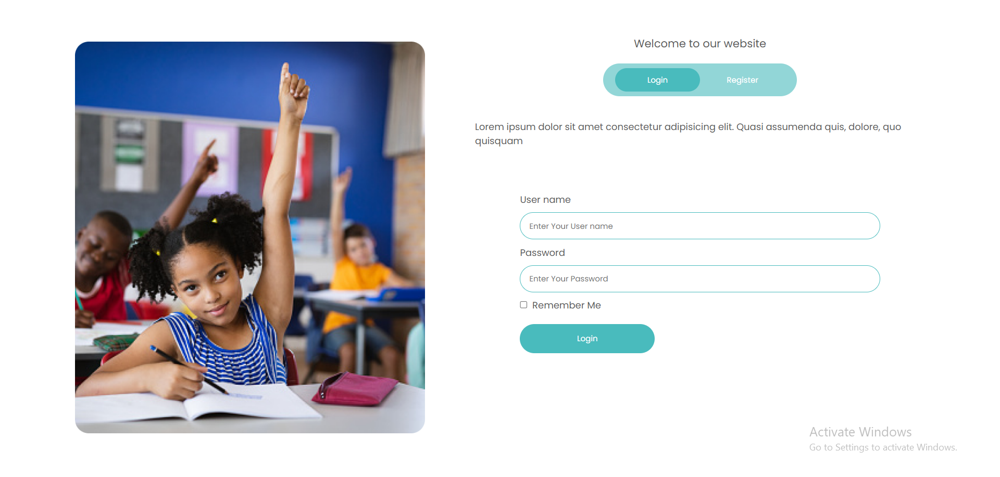
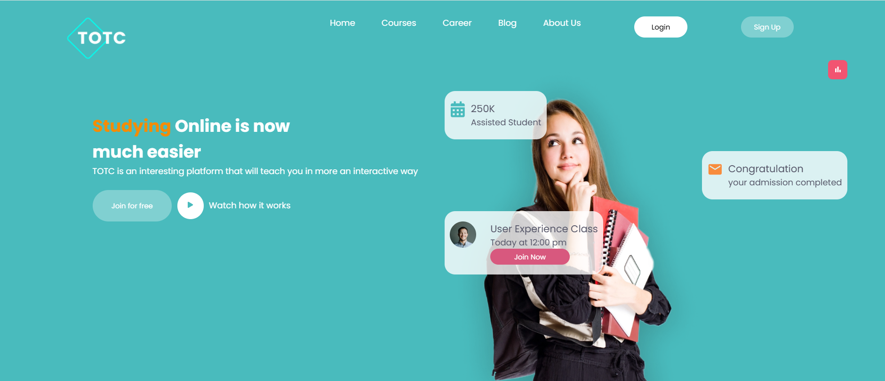
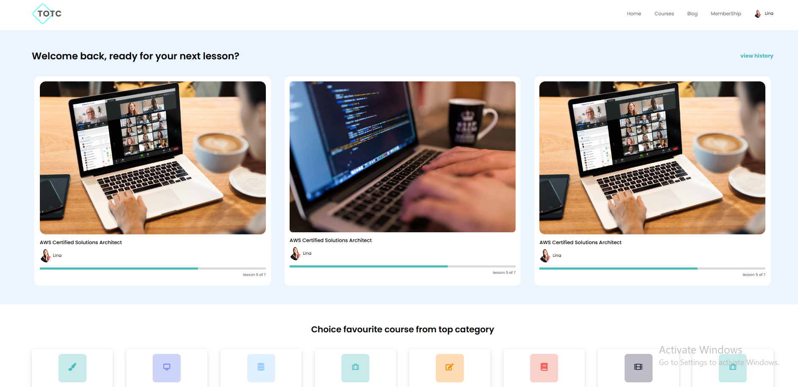

# E-Learning-Website

Welcome to Our Project, Dear Friends!

This project was created with love by [Eslam Radwan](https://github.com/Eslam-Radwan) and [Adham Saeed](https://github.com/adham667).

Wait for deploying... It's coming soon! 😊

## Content
- [Screenshots](#screenshots)
- [Insallation](#installation)
## Screenshots



---

---

---
## Installation
Clone the repository:
```bash
git clone https://github.com/Eslam-Radwan/E-Learning-Website.git
```


### Navigate to the project directory:

```bash
cd E-Learning-Website
```

### Install dependencies:
```bash
npm install


```
### Start the development server:
```bash
npm run dev
```
